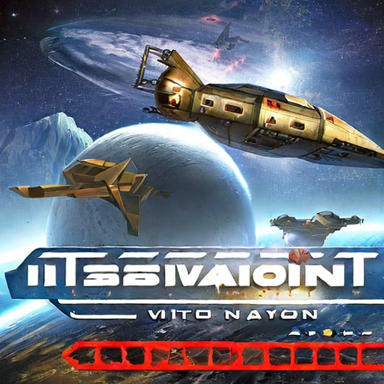
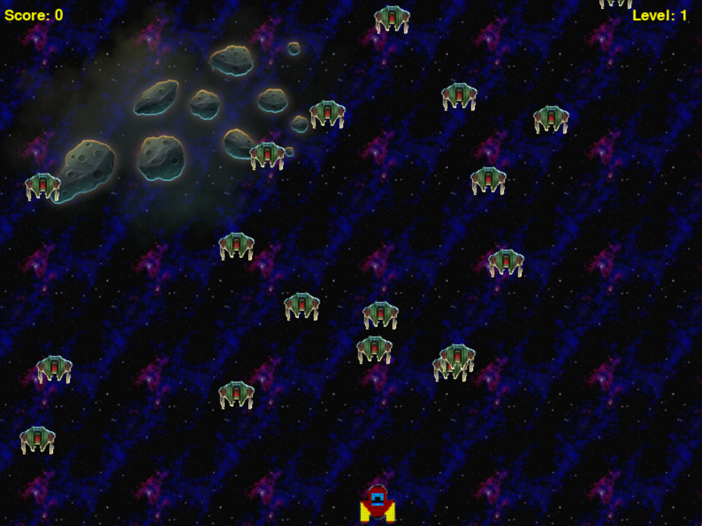

# Intelligent Invasion: Alien AI Strikes Back
Project for https://itch.io/jam/open-source-ai-game-jam

## Synopsis 


In a distant future, humanity faces a new threat as advanced alien AI launches an all-out assault on Earth. You are tasked with defending the planet against this intelligent invasion.

Engage in an epic battle as you take control of a highly advanced spaceship equipped with state-of-the-art weaponry. Your mission is to protect Earth from wave after wave of relentless alien forces.

Unleash your piloting skills as you navigate through a series of challenging levels set in various locations across the globe. Each level brings new dangers and obstacles to overcome, testing your reflexes and strategic thinking.

As you progress, the intensity of the invasion escalates. The alien AI adapts and evolves, becoming smarter and more aggressive with each passing wave. Stay vigilant and utilize power-ups and upgrades to enhance your spaceship's capabilities.

Immerse yourself in the heart-pounding action with captivating visuals and a dynamic soundtrack that intensifies as the battle rages on. Feel the weight of the world on your shoulders as you strive to repel the alien menace and ensure the survival of humanity.

Prepare for an unforgettable showdown as you confront the ultimate challenge: the Alien AI's stronghold. Will you have what it takes to outsmart the advanced AI and secure victory for Earth?

Intelligent Invasion: Alien AI Strikes Back is a thrilling arcade shooter that combines fast-paced gameplay, strategic decision-making, and an immersive sci-fi experience. Can you save humanity from the brink of annihilation? The fate of Earth rests in your hands!


## Install
Clone the repo, then install the requirement 
```
pip install -r requirements.txt
```
Once is done, let's play with
````
python main.py
`````

## Gameplay 

Quite simple : 
`````
← Left
→ Right
↑ Up 
↓ Down
Space bar: Shoot a bullet
`````

## AI tools used
[ChatGPT](https://openai.com/chatgpt)  
[Stable Diffusion](https://huggingface.co/spaces/stabilityai/stable-diffusion)  
[Hugging Face](https://huggingface.co/)  
[AudioLDM: Text2Audio](https://huggingface.co/spaces/haoheliu/audioldm-text-to-audio-generation)

## Assets generated by AI
### images
- [GameCover.jpeg](images/GameCover.jpeg)  
- [human_spaceship_up_scale_02.png](images/humain_spaceship_up_scale_02.png)  
- [human_spaceship.png](images/human_spaceship.png)  
- [mars_background.png](images/mars_background.png)  
### sounds 
- [explosion2.wav](sounds/explosion2.wav)  
- [laser2.wav](sounds/laser2.wav)  
- [theme_song.mp3](sounds/theme_song.mp3)  